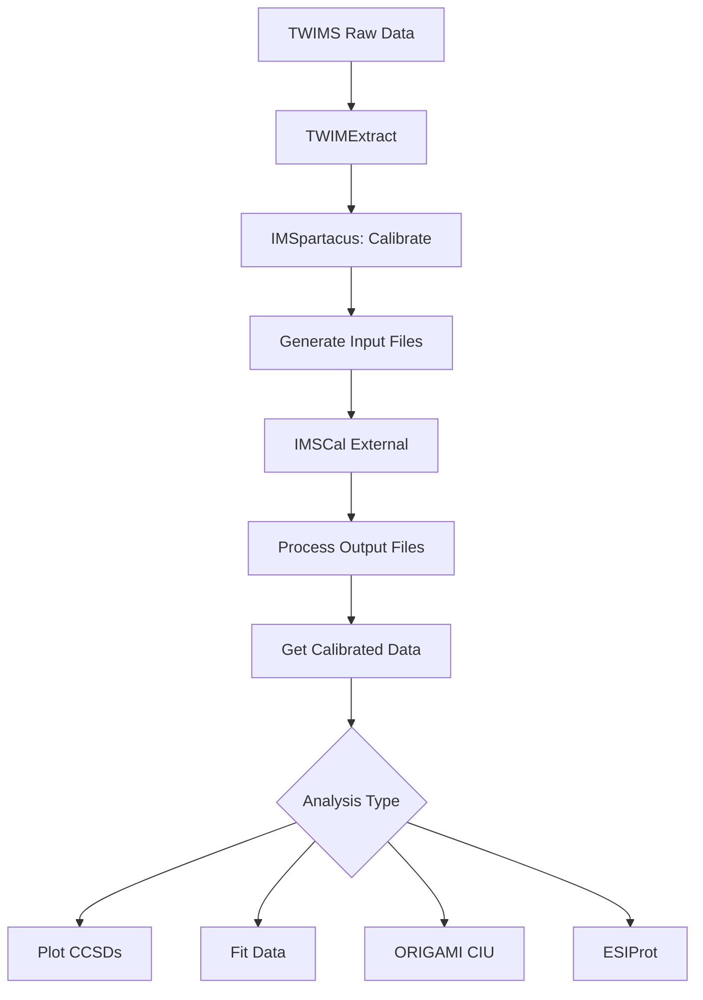

# IMSpartacus

**Ion Mobility Spectrometry Processing And Robust Toolkit for Analysis of Collision Cross Sections**

[](https://www.python.org/downloads/)
[](https://opensource.org/licenses/MIT)

## Overview

IMSpartacus is a comprehensive Python toolkit for processing traveling wave ion mobility spectrometry (TWIMS) data. It provides end-to-end workflows from raw data calibration to publication-ready visualizations, with a focus on collision cross section (CCS) analysis of biomolecules.

### Key Features

- **Drift Time to CCS Calibration**: Automated calibration using protein standards
- **Peak Detection and Fitting**: Multiple peak functions (Gaussian, pseudo-Voigt, asymmetric Gaussians)
- **CIU Analysis**: ORIGAMI-style collision-induced unfolding fingerprint generation
- **Charge State Deconvolution**: ESIProt algorithm for protein mass determination
- **Interactive Visualization**: Streamlit-based web interface for all tools
- **Publication-Ready Figures**: High-resolution, customizable plots for manuscripts

## Statement of Need

Traveling wave ion mobility spectrometry (TWIMS) is a powerful technique for structural biology and proteomics, but data processing remains challenging due to the need for external calibration and complex workflows. Existing tools are often scattered across different platforms (MATLAB, Origin, proprietary software) and require manual data handling between steps.

IMSpartacus addresses these challenges by providing:

1. **Integrated Workflow**: Seamless integration with TWIMExtract and IMSCal for complete analysis pipelines
2. **Reproducible Analysis**: All processing parameters are accessible and adjustable through the web interface
3. **Accessibility**: No programming knowledge required—all tools available through web browser
4. **Extensibility**: Well-documented Python API for custom analyses and method development

## Installation

### Quick Start

```bash
# Clone the repository
git clone https://github.com/yourusername/imspartacus.git
cd imspartacus

# Create virtual environment (recommended)
python -m venv venv
source venv/bin/activate  # On Windows: venv\Scripts\activate

# Install package
pip install -e .
```

### Requirements

- Python >=3.8
- pandas >=1.3.0
- numpy >=1.20.0
- scipy >=1.7.0
- matplotlib >=3.4.0
- plotly >=5.0.0
- streamlit >=1.20.0
- scikit-learn >=0.24.0

## Usage

### Web Interface

Launch the interactive web application:

```bash
streamlit run app.py
```

This opens a browser interface with 10 integrated tools:

1. **Calibrate**: Generate CCS calibration curves from protein standards
2. **Generate Input Files**: Create IMSCal input files from TWIMS data
3. **Process Output Files**: Convert drift times to CCS using calibration
4. **Get Calibrated Data**: Integrate with mass spectra for quantitative analysis
5. **Plot CCSDs**: Visualize collision cross section distributions
6. **Fit Data**: Detect and fit peaks with multiple functions
7. **Plot Mass Spectra**: Create publication-ready MS plots
8. **Generate Range Files**: Automate TWIMExtract range file creation
9. **ESIProt**: Deconvolute protein charge states
10. **ORIGAMI CIU**: Generate CIU fingerprint heatmaps

### Python API

IMSpartacus can also be used programmatically:

```python
from imspartacus.calibration import CalibrationProcessor
from imspartacus.fitting import PeakDetector, FittingEngine
from imspartacus.visualization import CCSDPlotter

# Load and calibrate data
calibrator = CalibrationProcessor()
calibrator.load_data("calibration.csv")
ccs_values = calibrator.calibrate(drift_times)

# Detect and fit peaks
detector = PeakDetector()
peaks = detector.detect_peaks(ccs_values, intensities)

fitter = FittingEngine()
results = fitter.fit_peaks(peaks, function="gaussian")

# Visualize results
plotter = CCSDPlotter()
plotter.plot_ccsd(ccs_values, intensities, fitted_data=results)
plotter.save("output.png", dpi=300)
```

## Typical Workflow



## Documentation

Detailed documentation is available in the `docs/` directory:

- **User Guide**: Step-by-step tutorials for each tool
- **API Reference**: Complete Python API documentation
- **Examples**: Jupyter notebooks with real-world examples
- **Theory**: Background on CCS calibration and TWIMS principles

## Testing

Run the test suite:

```bash
pytest tests/ -v --cov=imspartacus
```

## Contributing

Contributions are welcome! Please:

1. Fork the repository
2. Create a feature branch (`git checkout -b feature/amazing-feature`)
3. Commit your changes (`git commit -m 'Add amazing feature'`)
4. Push to the branch (`git push origin feature/amazing-feature`)
5. Open a Pull Request

Please see `CONTRIBUTING.md` for detailed guidelines.

## Citation

If you use IMSpartacus in your research, please cite:

```bibtex
@article{imspartacus2025,
  title={IMSpartacus: A Comprehensive Toolkit for TWIMS Data Analysis},
  author={Your Name and Collaborators},
  journal={Journal of Open Source Software},
  year={2025},
  volume={X},
  number={Y},
  pages={ZZZZ},
  doi={10.21105/joss.XXXXX}
}
```

## Acknowledgments

IMSpartacus builds upon and integrates with:

- **TWIMExtract**: Ion mobility data extraction (Sergent et al., 2023)
- **IMSCal**: CCS calibration software (Haynes et al., 2017)
- **ORIGAMI**: CIU analysis concepts (Ral et al., 2016)

## License

This project is licensed under the MIT License - see the [LICENSE](LICENSE) file for details.

## Contact

- **Issues**: [GitHub Issues](https://github.com/yourusername/imspartacus/issues)
- **Email**: your.email@example.com
- **Website**: https://github.com/yourusername/imspartacus

## References

1. Sergent, I., Adjieufack, A. I., Gaudel-Siri, A., & Charles, L. (2023). *International Journal of Mass Spectrometry*, 492, 117112.

2. Haynes, S. E., Polasky, D. A., Dixit, S. M., Majmudar, J. D., Neeson, K., Ruotolo, B. T., & Martin, B. R. (2017). *Analytical Chemistry*, 89(10), 5669-5672.

3. Ral, C., Thalassinos, K., Hailes, H. C., & Tabor, A. B. (2016). *Chemical Communications*, 52(50), 7865-7868.
